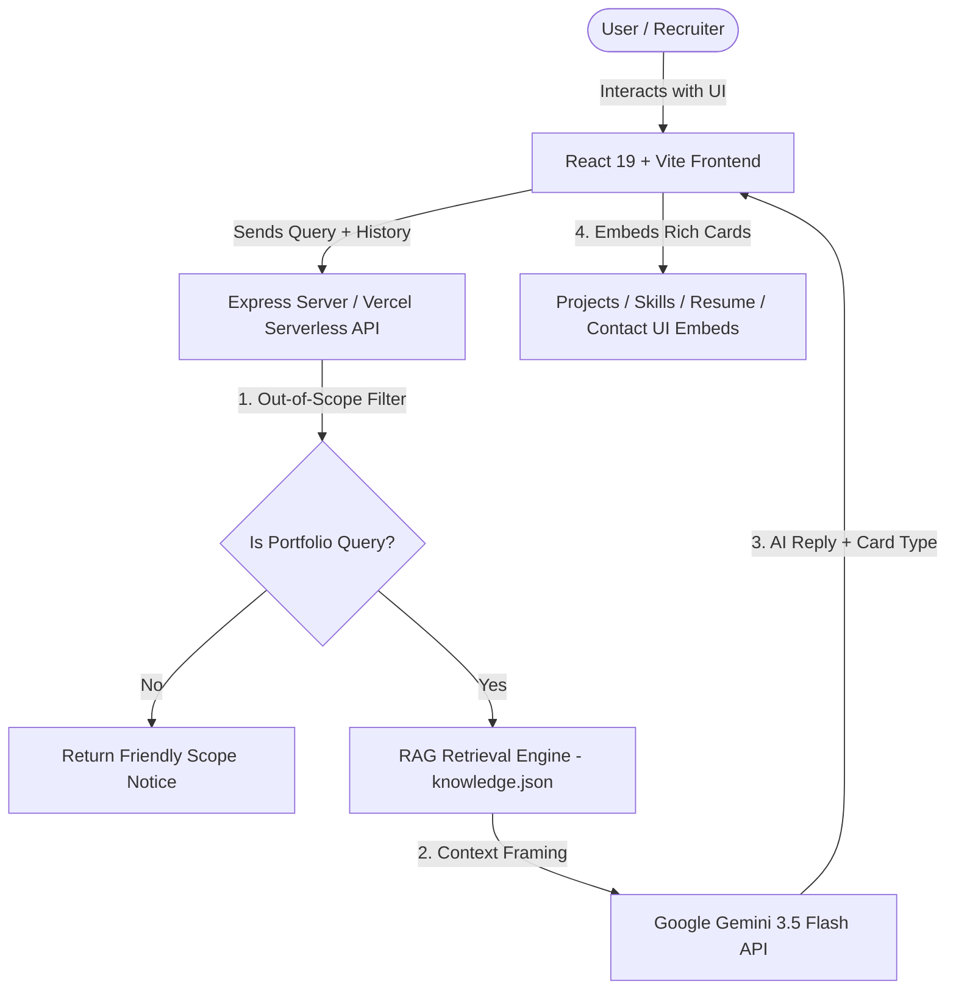

# 🚀 Rohit Kumar Kohli — Full-Stack Developer Portfolio & AI Assistant

[](https://react.dev)
[](https://www.typescriptlang.org/)
[](https://tailwindcss.com)
[](https://expressjs.com)
[](https://ai.google.dev)
[](https://vercel.com)

A state-of-the-art, production-grade **Developer Portfolio & AI Assistant** built using **React 19**, **TypeScript**, **Express**, **Tailwind CSS v4**, and **Google Gemini 3.5 Flash**. 

Features an integrated **RAG-powered AI Chatbot** that acts as a personal assistant for recruiters and visitors, answering questions about skills, projects, work experience, certifications, and providing direct resume downloads.

---

## 🌟 Live Demos & Links

- 🌐 **Portfolio Website**: [rohit-kumar-kohli-portfolio.vercel.app](https://github.com/Rohitkohli28/rohit-kumar-kohli-portfolio)
- 🏥 **Doctor Appointment System (Project 01)**: [rohit-healthcare-appointment.vercel.app](https://rohit-healthcare-appointment.vercel.app)
- 💬 **Real-Time Chat Application (Project 03)**: [rohit-chat-app.vercel.app](https://rohit-chat-app.vercel.app)
- 👨‍💻 **GitHub Profile**: [@Rohitkohli28](https://github.com/Rohitkohli28)
- 💼 **LinkedIn Profile**: [in/rohitkumarkohli](https://linkedin.com/in/rohitkumarkohli)

---

## 🔥 Key Features

### 🤖 1. Floating AI Portfolio Assistant (RAG Engine)
- **Natural Language Conversations**: Powered by **Google Gemini 3.5 Flash** (`@google/genai`) and a custom server/client-side **Retrieval-Augmented Generation (RAG)** engine.
- **Rich Interactive UI Cards**:
  - 📄 **Resume Card**: Direct PDF download (`/Rohit_Kumar_Kohli_Resume.pdf`) and preview button.
  - 🚀 **Projects Cards**: Interactive cards with Live Demo and GitHub links.
  - ⚡ **Skills Matrix**: Categorized animated badges with proficiency levels (highlighting Java at 90%).
  - 💼 **Experience Timeline**: Internship timeline at Celebal Tech, SmartBridge, SmartED Innovations, and Microsoft Azure.
  - 🏆 **Certifications**: Google Cloud Hackathon Top Rank, Microsoft Azure Developer Associate, Meta Frontend Developer, and ServiceNow Certified.
- **Context-Aware History**: Remembers multi-turn chat context and resolves pronouns naturally.
- **Out-of-Scope Protection**: Gracefully restricts non-portfolio queries to keep conversations professional.

### 📐 2. System Design & Architecture Visualizer
- Visual topology diagrams, request lifecycles, Mongoose database schemas, and security blueprints for every featured project right inside the portfolio modal.

### 💻 3. Konami CLI Terminal Modal
- Interactive CLI terminal modal for developers accessible via shortcut.

### 🎨 4. Ultra-Premium Aesthetics
- Built with **Glassmorphism**, smooth **Framer Motion** micro-animations, theme toggling, and zero layout shift.

---

## 🛠️ Technology Stack

| Domain | Technologies Used |
| :--- | :--- |
| **Frontend** | React 19, TypeScript, Tailwind CSS v4, Motion (Framer Motion), Lucide Icons |
| **Backend API** | Node.js, Express 4, Vercel Serverless Functions, Nodemailer SMTP |
| **Artificial Intelligence** | Google Gemini 3.5 Flash API (`@google/genai`), RAG Knowledge Engine |
| **Databases & Tools** | MongoDB, Redis, Docker, Git, Postman, Power BI |

---

## 🏗️ System Architecture



---

## 🚀 Getting Started

### Prerequisites
- **Node.js**: `v18.0.0` or higher
- **npm**: `v9.0.0` or higher

### 1. Clone the Repository
```bash
git clone https://github.com/Rohitkohli28/rohit-kumar-kohli-portfolio.git
cd rohit-kumar-kohli-portfolio
```

### 2. Install Dependencies
```bash
npm install
```

### 3. Environment Configuration
Create a `.env` file in the root directory:
```env
GEMINI_API_KEY="YOUR_GEMINI_API_KEY"
APP_URL="http://localhost:3000"

# Nodemailer Contact Form Configuration
SMTP_HOST="smtp.gmail.com"
SMTP_PORT="587"
SMTP_USER="your-email@gmail.com"
SMTP_PASS="your-app-password"
PORTFOLIO_OWNER_EMAIL="kohlirohit2428@gmail.com"
```

### 4. Run Development Server
```bash
npm run dev
```
Open [http://localhost:3000](http://localhost:3000) in your browser.

---

## 📦 Vercel Deployment

This repository is pre-configured with `vercel.json` and `api/index.ts` for instant Vercel Serverless Function deployment.

1. Push your changes to GitHub:
   ```bash
   git add .
   git commit -m "Update README and configuration"
   git push origin main
   ```
2. Import repository on [Vercel Dashboard](https://vercel.com/new).
3. Add your **Environment Variables** (`GEMINI_API_KEY`, `SMTP_USER`, `SMTP_PASS`, `PORTFOLIO_OWNER_EMAIL`).
4. Click **Deploy**!

---

## 👤 Author & Contact

**Rohit Kumar Kohli**
- **Role**: Full-Stack Developer & Software Engineer (B.Tech CSE, 8.4 CGPA)
- **Location**: Dehradun / Jaipur, India
- **Email**: [kohlirohit2428@gmail.com](mailto:kohlirohit2428@gmail.com)
- **GitHub**: [@Rohitkohli28](https://github.com/Rohitkohli28)
- **LinkedIn**: [Rohit Kumar Kohli](https://linkedin.com/in/rohitkumarkohli)

---

&copy; 2026 Rohit Kumar Kohli. All rights reserved.
